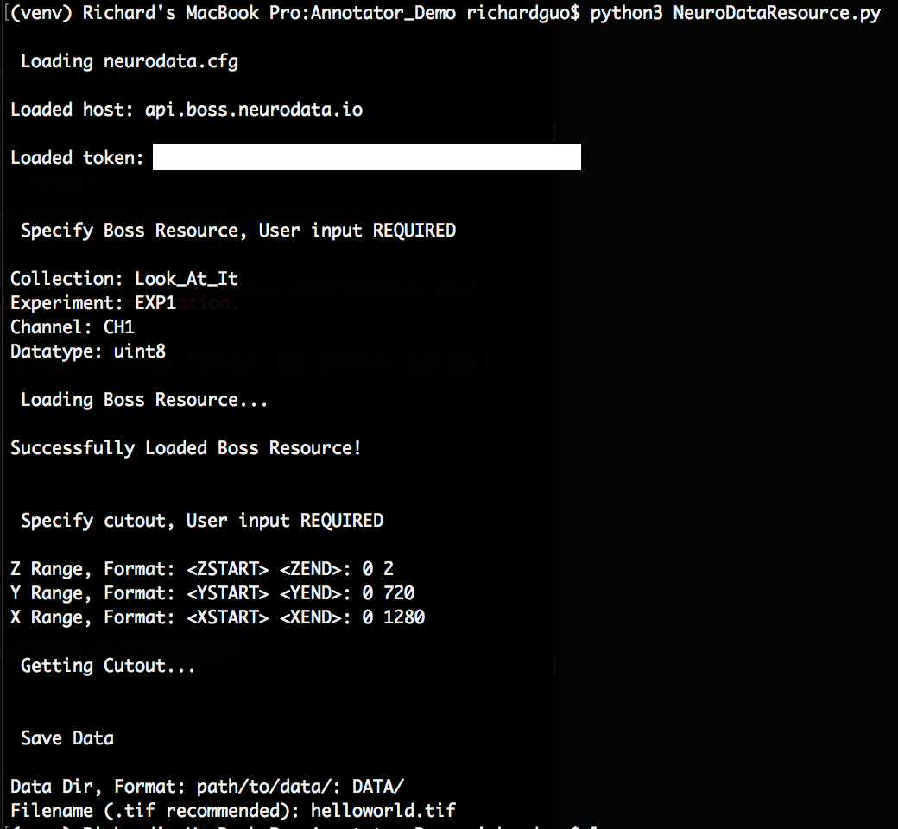

.. NeuroData Annotation documentation master file, created by
   sphinx-quickstart on Sun Oct 15 23:15:51 2017.
   You can adapt this file completely to your liking, but it should at least
   contain the root `toctree` directive.

Welcome to NeuroData Annotation's documentation!
================================================

1. Clone annotation repo. In Terminal type:
    ``git clone https://github.com/rguo123/NeuroData_Annotate.git``

2. Get BOSS API token by logging in to https://api.boss.neurodata.io/

3. Create ``neurodata.cfg`` file and insert BOSS token as shown below:

  .. code-block:: bash
     :emphasize-lines: 3

     [Default]
     protocol = https
     host = api.boss.neurodata.io
     token = edef359a8de270163c911dcef5d467a72348d68d

  .. toctree::
     :maxdepth: 2
     :caption: Contents:

4. Pull data from BOSS by typing ``python3 NeuroDataResource.py`` in terminal and following the input prompt.

5. Annotate (FIJI demo incoming)

6. To push annotations to the BOSS, edit ``gen_commands.py`` file and input annotation file parameters.

7. Once all inputs are filled out, type ``python3 gen_commands.py`` in terminal.

8. Paste command line output into terminal.

9. Pray it works.

Indices and tables
==================

* :ref:`genindex`
* :ref:`modindex`
* :ref:`search`
